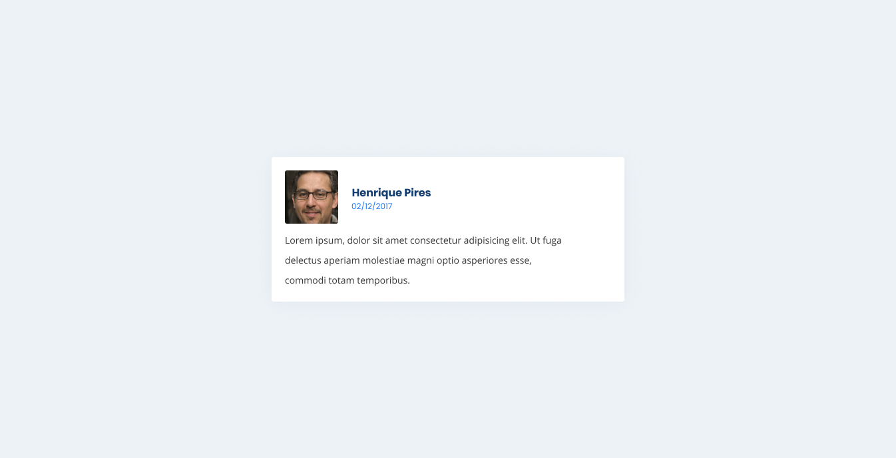

### Exercício Card com Flexbox

*Agora que você já conhece algumas propridades do flexbox, que tal começar a usar elas para fazer alguns componentes?*

Vamos lá...

O exercício consistem em criar um card, com o depoimento de um usuário do novo site do crescer que eu inventei agora. O texto pode ser um "Lorem Ipsum", e a imagem pode ser daqui: https://www.thispersondoesnotexist.com/ Usem o Figma pra redimensionar a imagem pra um tamanho que vocês precisam.
Boa prática: Não façam o usuário baixar uma imagem muito maior do que ele precisa (me refiro ao *peso* da imagem)

O layout será este:

[Abrir em uma nova aba ↗](./flexbox-1.jpg)

Você deve deixar o resultado o mais fiel possível ao layout.

Uma dica, se você está chutando as propriedades, eu recomendo fortemente pedir ajuda ao instrutor ou aos monitores. O fato de aprender usar sem chutar vai te ajudar a ganhar muita velocidade nos próximos exercícios.

Valendo ⏰
